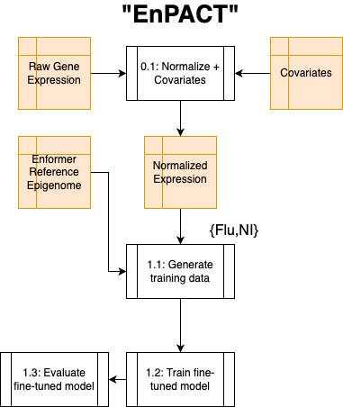
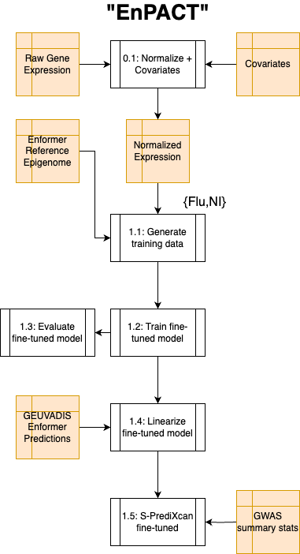

# What is EnPACT?

EnPACT is a modeling strategy which fine tunes DNA sequence-based molecular predictors to new datasets. Generally, the steps to train an EnPACT model are as follows: 

1. Assemble a training dataset of molecular features (gene expression, ChIP-seq peaks, etc.) of which you want to be able to predict the genetic component of variation across features. This will be the "Y" or "output" into the EnPACT model during training.
2. Generate "reference epigenome" predictions at molecular feature loci by passing reference genome DNA sequence from each loci into the DNA sequence-based molecular predictor. These "reference epigenome" predictions will then become the "X" or "input" into the EnPACT model during training.
3. Train the EnPACT model of choice across loci in the genome to predict "Y" from "X" at each loci in the training dataset using standard model training practices.

Pretty simple. In practice, the "En" in "EnPACT" refers to "Enformer", the sequence-based predictor explored here. However, there is no reason that this should be the **only** model which can fulfill this role, so this code is intentionally modular to encourage exploration of other sequence-based predictors. The EnPACT model is also a flexible, but important, choice. Linear elastic net and a simple convolutional neural net are two currently implemented options, but exploration is again encouraged with modular code support. 

## Training an EnPACT model

The steps to train an EnPACT model are labeled in the following figure:

Scripts for each step are included in the "/scripts/" directory. For example, step 1.1 corresponds to "/scripts/1.1_generate_enpact_training_data.py".

### Configuration

Inputs for all steps are specified in a json style config file. An example can be found in [Example configuration with TWAS](example_json/example_config_with_twas.json). 

# Using EnPACT to explore the genetic component of diseases

Because molecular phenotypes must be related to the genetically controlled components of disease (as dictated by the central dogma), genetic predictors of molecular phenotypes can help bridge the gap between underlying genetic sequence and higher level observed phenotype. Integrative analyses used to make these insights are plenty. Currently, the following integrative analyses are supported in this repository:

1. TWAS (SPrediXcan)

## TWAS with EnPACT

### Overview

EnPACT models try to learn which elements of underlying DNA sequence are predictive of variation in the molecular phenotype of interest. This is similar to existing models used in TWAS analysis relating GWAS loci to molecular loci. The major difference is that existing TWAS models are trained to predict the variation of features (such as individual genes) across individuals in a population, while EnPACT models try to use variation across similar features in the genome (different genes) during training. Both training approaches have theoretical pros and cons, but a nice possibility is to be able to also perform TWAS analysis with EnPACT style models. 

### TWAS with SPrediXcan

Doing this is not trivial. Here we implement a tractable method of converting the EnPACT model, which does not annotate individual SNP variant effects, into a form a compatible with the TWAS software SPrediXcan. The process is called **linearization** and involves the contruction of elastic models for each molecular feature in the linearization dataset. The models predict variation in each individual molecular feature across individuals in the linearization dataset. Rather than predicting observed expression in these individuals, as is the case in existing TWAS models, the linearization models predict _personalized_ EnPACT predictions generated from each individuals unique DNA sequence for that molecular feature. In other words, these models approximate the EnPACT personalized predictions in a TWAS-compatible way. 

The workflow including TWAS is as follows:

## To-do

- [] Better synchronize names of steps with steps in config file
- [] Store only a single copy of Enformer personalized predictions to reduce memory overhead.
- [] Option to delete personalized EnPACT predictions after contruction of linearized models.

